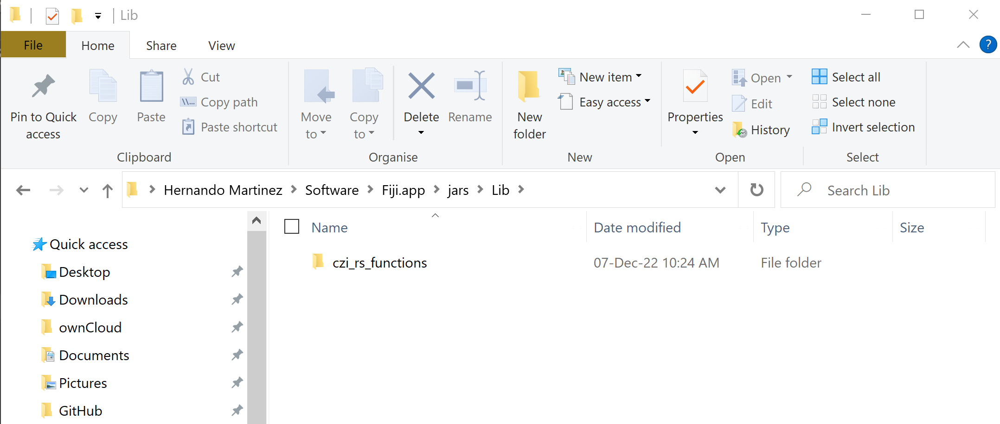

# czi-rs-functions

This repository contains functions for dealing with .czi files in Fiji.

The funcions are not used directly but are called from other scripts, such as this one:

https://github.com/HernandoMV/czi-roisplitter

To add them to fiji, navigate inside the Fiji.app, and go inside the jars folder.
Create a new folder called "Lib", and copy the "czi_rs_functions" folder inside, such as this:

  

